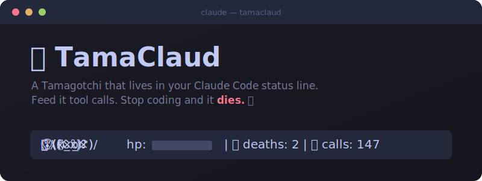

<div align="center">



**Um Tamagotchi que vive na status line do Claude Code.**
**Se alimenta de tool calls. Se você não codar, ele morre. E depois te assombra.** 💀

🌐 [English](./README.en.md) · [Español](./README.es.md) · [Português](./README.pt.md)

</div>

---

## A ideia

Você abre o Claude Code. Um ovinho choca na sua status line. Cada tool call o alimenta. Ele dança quando dá certo, entra em pânico quando falha.

Aí você vai pra uma reunião. Duas horas depois ele está morrendo de fome. Quatro horas depois está morto, e seu contador de mortes sobe em um. Ele lembra. Para sempre.

Você volta e ele ressuscita como ovo — mas as cicatrizes ficam no JSON.

```
🐣 (^‿^) vida:██████░░░░ 60%  |  💀 mortes: 2  |  🍖 calls: 147
```

## Estados

| | Sprite | Quando |
|---|---|---|
| 🥚 Ovo | `(·)` | Primeira vez / ressuscitando |
| 😴 Dormindo | `(-.-)zzz` | Claude está pensando |
| 😊 Feliz | `(^‿^)` | Idle, tudo bem |
| 🍖 Comendo | `(°ᴗ°)♪` | Tool call em progresso |
| 🎉 Dançando | `\(^o^)/` | Tool success |
| 😰 Estressado | `(ó﹏ò)` | Tool failure |
| 😱 Faminto | `(×_×)` | Sem codar há 2h |
| 💀 Morto | `(x_x)` | Sem codar há 4h |
| 👻 Fantasma | `(†_†)` | Esperando ressurreição |

## Instalação

1. Copie o script para o diretório do Claude:

```bash
cp tamaclaud.py ~/.claude/tamaclaud.py
```

2. Adicione os hooks e statusLine em `~/.claude/settings.json`:

```json
{
  "hooks": {
    "PreToolUse": [
      {
        "hooks": [{
          "type": "command",
          "command": "python3 ~/.claude/tamaclaud.py --event pre_tool"
        }]
      }
    ],
    "PostToolUse": [
      {
        "hooks": [{
          "type": "command",
          "command": "python3 ~/.claude/tamaclaud.py --event post_tool --success $CLAUDE_TOOL_SUCCESS"
        }]
      }
    ],
    "Stop": [
      {
        "hooks": [{
          "type": "command",
          "command": "python3 ~/.claude/tamaclaud.py --event stop"
        }]
      }
    ]
  },
  "statusLine": {
    "type": "command",
    "command": "python3 ~/.claude/tamaclaud.py --status"
  }
}
```

3. Pronto! Abra o Claude Code e comece a codar para alimentar seu TamaClaud.

> **Dica Windows:** use caminhos absolutos como `python3 "C:/Users/voce/.claude/tamaclaud.py" --status` em vez de `~`.

## Como funciona a vida

```
Cada tool call bem-sucedido  → +10 vida
Cada tool failure            → -5 vida
Sem atividade 30 min         → -1 vida por minuto
Sem atividade 2h             → FAMINTO
Sem atividade 4h             → MORTO (contador de mortes +1)
Nova sessão estando morto    → ressurreição (volta com 50 de vida)
Vida chega a 0               → MORTE instantânea
```

## Mudar o idioma

Inglês por padrão. Mude quando quiser:

```bash
python3 ~/.claude/tamaclaud.py --lang es   # Español
python3 ~/.claude/tamaclaud.py --lang pt   # Português
python3 ~/.claude/tamaclaud.py --lang en   # English
```

## Arquivo de estado

Salvo em `~/.claude/tamaclaud.json`:

```json
{
  "hp": 80,
  "state": "happy",
  "last_activity": "2026-06-13T10:30:00+00:00",
  "deaths": 2,
  "total_tool_calls": 147,
  "born": "2026-06-01T09:00:00+00:00",
  "lang": "pt"
}
```

## Uso manual (debug)

```bash
# Ver status
python3 ~/.claude/tamaclaud.py --status

# Simular eventos
python3 ~/.claude/tamaclaud.py --event pre_tool
python3 ~/.claude/tamaclaud.py --event post_tool --success true
python3 ~/.claude/tamaclaud.py --event post_tool --success false
python3 ~/.claude/tamaclaud.py --event stop
```

## ⚠️ Nota sobre Windows

Há um [bug conhecido no Claude Code no Windows](https://github.com/anthropics/claude-code/issues/66455) onde o `statusLine` custom nunca é invocado automaticamente. Os hooks (alimentar, vida, morte) funcionam bem — só a barra persistente não renderiza ainda. **Workaround:** digite `tamaclaud` no CLI para ver seu pet.

## 🔒 Segurança e privacidade

Tudo fica local. Sem chamadas de rede. Sem telemetria. Nada sai da sua máquina, nunca. O arquivo de estado contém apenas: vida, nome do estado, timestamps, contador de mortes e de calls. Sem código, sem caminhos, sem dados pessoais.

## FAQ

**Precisa de um arquivo de config?**
Só um JSON que ele mesmo gerencia. Você nunca toca nele.

**O que acontece se ele morrer enquanto eu durmo?**
Ele vira fantasma. Quando você volta e coda, ele ressuscita como ovo com 50 de vida. A morte fica no registro dele.

**Posso ter mais de um?**
Um pet, uma máquina. Como responsabilidade de verdade.

**Por que "TamaClaud"?**
Você sabe exatamente por quê.

## Requisitos

- Python 3.6+ (sem dependências externas)
- Claude Code com suporte a hooks e status line
